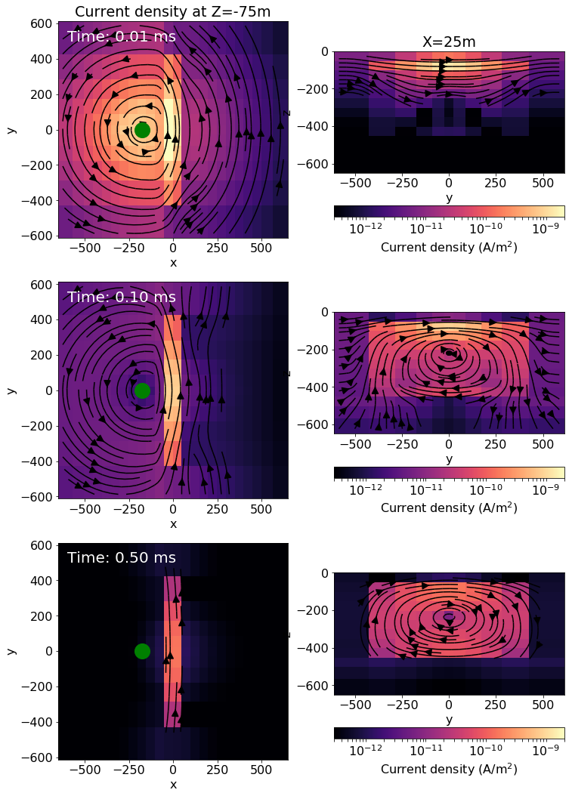

Open source software for simulations and inversions of airborne electromagnetic data
====================================================================================

.. image:: https://travis-ci.org/simpeg-research/heagy-2018-AEM.svg?branch=master
    :target: https://travis-ci.org/simpeg-research/heagy-2018-AEM

.. image:: https://mybinder.org/badge.svg
    :target: https://mybinder.org/v2/gh/simpeg-research/heagy_2018_AEM/master
    
.. image:: https://zenodo.org/badge/124603211.svg
   :target: https://zenodo.org/badge/latestdoi/124603211

Notebooks and python scripts to reproduce the figures shown in
`"Open source software for simulations and inversions of airborne electromagnetic data," <https://github.com/simpeg-research/heagy_2018_AEM/blob/master/Heagy_etal_2018_aem_workshop.pdf>`_
submitted to the AEM 2018 workshop.

The slides used in the presentation are available at: https://speakerdeck.com/lheagy/open-source-software-for-simulations-and-inversions-of-airborne-electromagnetic-data

**Summary**

Inversions of airborne EM data are often an iterative process, not only requiring that the researcher be able to explore the impact of changing components such as the choice of regularization functional or model parameterization, but also often requiring that forward simulations be run and fields and fluxes visualized in order to build an understanding of the physical processes governing what we observe in the data. In the hope of facilitating this exploration and promoting reproducibility of geophysical simulations and inversions, we have developed the open source software package, SimPEG. The software has been designed to be modular and extensible with the goal of allowing researchers to interrogate all of the components and to facilitate the exploration of new inversion strategies. We present an overview of the software in its application to airborne EM and demonstrate its use for visualizing fields and fluxes in a forward simulation as well as its flexibility in formulating and solving the inverse problem. We invert a line of airborne TDEM data over a conductive vertical plate using a 1D voxel-inversion, a 2D voxel inversion and a parametric inversion, where all of the forward modelling is done on a 3D grid. The results in this paper can be reproduced  by using the provided Jupyter notebooks. The Python software can also be modified to allow users to experiment with parameters and explore the physics of the electromagnetics and intricacies of inversion.

**Notebooks**

There are 4 notebooks in this repository:

- `TEM_VerticalConductor_2D_forward.ipynb <https://github.com/simpeg-research/heagy_2018_AEM/blob/master/notebooks/TEM_VerticalConductor_2D_forward.ipynb>`_ : runs a forward simulation of an airborne electromagnetic simulation over a conductive plate. This notebook was used to generate figures 1-4 in the abstract
- `TEM_VerticalConductor_1D_stitched_inversion.ipynb <https://github.com/simpeg-research/heagy_2018_AEM/blob/master/notebooks/TEM_VerticalConductor_1D_stitched_inversion.ipynb>`_ : Using the forward simulated data from the previous notebook, we run 1D inversions over the plate (Figure 5 in the abstract).
- `TEM_VerticalConductor_2D_inversion_load.ipynb <https://github.com/simpeg-research/heagy_2018_AEM/blob/master/notebooks/TEM_VerticalConductor_2D_inversion_load.ipynb>`_ : This notebook loads the 2D inversion results over the plate (Figure 6 in the abstract). The 2D inversion was run using the script `2dinv_smooth.py <https://github.com/simpeg-research/heagy_2018_AEM/blob/master/notebooks/2d_inv_smooth/2dinv_smooth.py>`_.
- `TEM_VerticalConductor_parametric_inversion_load.ipynb <https://github.com/simpeg-research/heagy_2018_AEM/blob/master/notebooks/TEM_VerticalConductor_parametric_inversion_load.ipynb>`_ : This notebook loads the 2D parametric inversion inversion results (Figure 7 in the abstract). The 2D parametric inversion was run using the script `2dinv_parametric.py <https://github.com/simpeg-research/heagy_2018_AEM/blob/master/notebooks/2d_inv_parametric/2d_inv_parametric.py>`_ .

**Usage**

Dependencies are specified in `requirements.txt <https://github.com/simpeg-research/heagy_2018_AEM/blob/master/requirements.txt>`_

.. code::

    pip install -r requirements.txt

Please `make an issue <https://github.com/simpeg-research/heagy_2018_AEM/issues>`_ if you encounter any problems while trying to run the notebooks.
